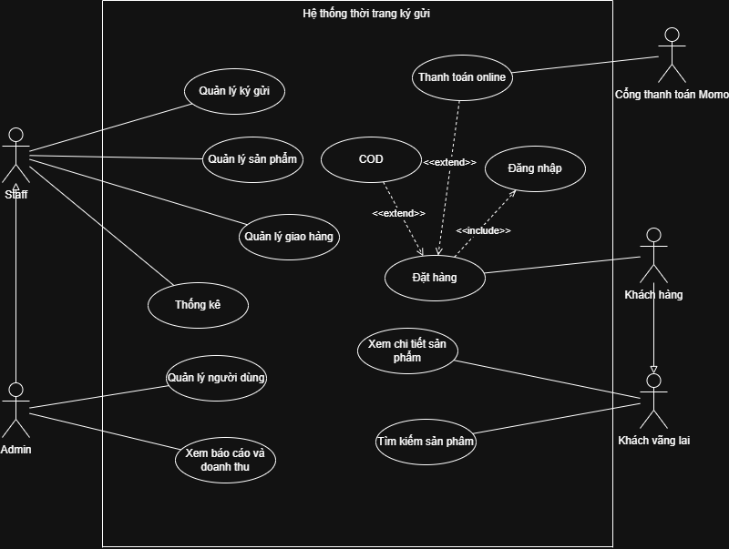

### **TÀI LIỆU ĐẶC TẢ YÊU CẦU PHẦN MỀM (SRS)**

**Tên Đề Tài:** Xây dựng website quản lý và kinh doanh thời trang ký gửi Simi

**Sinh viên:** Ngô Đình Dương - MSSV: 2351050025

**Giảng viên hướng dẫn:** Nguyễn Văn Bảy

**Ngày:** 07/07/2026

---

### **1. Mô tả tổng quan sản phẩm**

Simi là hệ thống web hỗ trợ cửa hàng quản lý hoạt động ký gửi và kinh doanh các sản phẩm thời trang như quần áo, giày dép và phụ kiện.

Hệ thống cho phép khách hàng tìm kiếm, xem sản phẩm, thêm giỏ hàng, đặt hàng và theo dõi đơn hàng. Nhân viên có thể tiếp nhận lô hàng ký gửi, quản lý từng sản phẩm, thời hạn ký gửi, trạng thái bán và khoản thanh toán cho người ký gửi. Quản trị viên có thể quản lý người dùng, nhân viên cửa hàng, sản phẩm, danh mục, đơn hàng và hoạt động của hệ thống.

Mục tiêu của hệ thống là số hóa quy trình ký gửi, giảm sai sót trong quản lý, tăng tính minh bạch và hỗ trợ cửa hàng tiếp cận khách hàng qua kênh trực tuyến.

---

### **2. Yêu cầu chức năng**

#### **Module: Quản lý Tài khoản**

- **Đăng ký tài khoản:**
    - Là một Khách hàng, tôi muốn **đăng ký tài khoản bằng email và mật khẩu** để có thể mua hàng và sử dụng các chức năng cá nhân
- **Đăng nhập:**
    - Là một **Người dùng**, tôi muốn **đăng nhập vào hệ thống** sau khi đã đăng ký thành công, để tôi có thể xem hàng và mua hàng
- **Đăng xuất:**
    - Là một **Người dùng**, tôi muốn **đăng xuất an toàn khỏi tài khoản**
- **Quản lý hồ sơ:**
    - Là một **Người dùng**, tôi muốn **xem và cập nhật thông tin cá nhân như họ tên, số điện thoại, địa chỉ và mật khẩu**

#### **Module: Quản lý Sản phẩm**

**Xem danh sách sản phẩm:**

Là một khách hàng, tôi muốn xem các sản phẩm đang được bán để lựa chọn sản phẩm phù hợp.

**Xem chi tiết sản phẩm:**

Là một khách hàng, tôi muốn xem thông tin về giá, kích thước, thương hiệu, tình trạng và hình ảnh sản phẩm.

**Tìm kiếm và lọc sản phẩm:**

Là một khách hàng, tôi muốn tìm kiếm và lọc sản phẩm theo danh mục, giá, kích thước, thương hiệu hoặc tình trạng.

**Quản lý sản phẩm:**

Là một nhân viên hoặc quản trị viên, tôi muốn tạo, xem, cập nhật và quản lý trạng thái sản phẩm.

#### **Module: Quản lý ký gửi**

**Tiếp nhận lô hàng ký gửi:**

Là một nhân viên, tôi muốn tạo lô ký gửi cho khách hàng sau khi hai bên đã kiểm tra và thống nhất tại cửa hàng.

**Quản lý sản phẩm trong lô:**

Là một nhân viên, tôi muốn thêm các sản phẩm được chấp nhận vào lô ký gửi và ghi nhận giá bán, thời hạn, tình trạng sản phẩm.

**Theo dõi trạng thái ký gửi:**

Là một nhân viên, tôi muốn theo dõi sản phẩm đang bán, đã bán, hết hạn hoặc đã trả lại.

**Thanh toán cho người ký gửi:**

Là một nhân viên hoặc quản trị viên, tôi muốn ghi nhận khoản tiền cần thanh toán cho người ký gửi sau khi lô hàng kết thúc hoặc toàn bộ sản phẩm đã được bán.

#### **Module: Giỏ hàng và đặt hàng**

**Quản lý giỏ hàng:**

Là một khách hàng, tôi muốn thêm, cập nhật hoặc xóa sản phẩm trong giỏ hàng trước khi đặt mua.

**Đặt hàng:**

Là một khách hàng, tôi muốn cung cấp thông tin nhận hàng, chọn phương thức thanh toán và xác nhận đơn hàng.

**Theo dõi đơn hàng:**

Là một khách hàng, tôi muốn xem trạng thái xử lý và lịch sử các đơn hàng của mình.

**Quản lý đơn hàng:**

Là một nhân viên, tôi muốn xác nhận, đóng gói, giao hàng, hoàn thành hoặc hủy đơn hàng.

#### **Module: Thanh toán và giao hàng**

**Chọn phương thức thanh toán:**

Là một khách hàng, tôi muốn lựa chọn COD, chuyển khoản ngân hàng hoặc MoMo theo điều kiện áp dụng.

**Áp dụng quy định giao hàng:**

Hệ thống chỉ cho phép COD tại Thành phố Hồ Chí Minh. Khách hàng ngoài Thành phố Hồ Chí Minh phải thanh toán trước.

**Tính phí vận chuyển:**

Hệ thống hỗ trợ miễn phí vận chuyển tại Tân Hưng, Tân Thuận, Tân Mỹ, Nhà Bè, Vĩnh Hội, Khánh Hội theo chính sách của cửa hàng.

#### **Module: Quản trị hệ thống**

**Quản lý người dùng:**

Là một quản trị viên, tôi muốn xem, cập nhật trạng thái và phân quyền người dùng.

**Quản lý danh mục:**

Là một quản trị viên, tôi muốn tạo, sửa, xóa và sắp xếp danh mục sản phẩm.

**Theo dõi doanh thu:**

Là một quản trị viên, tôi muốn xem doanh thu bán hàng và các khoản phải thanh toán cho người ký gửi.

**Quản lý hoạt động hệ thống:**

Là một quản trị viên, tôi muốn theo dõi sản phẩm, đơn hàng, thanh toán và các dữ liệu vận hành quan trọng.

---

### **3. Yêu cầu phi chức năng (Non-functional Requirements)**

#### Hiệu năng

- Các thao tác cơ bản như đăng nhập, tìm kiếm sản phẩm và tải danh sách cần phản hồi trong khoảng 2–3 giây trong điều kiện sử dụng bình thường.

#### Khả dụng

- Giao diện phải rõ ràng, dễ sử dụng đối với khách hàng, nhân viên và quản trị viên.
- Thông báo lỗi, thành công và xác nhận thao tác phải dễ hiểu.

#### Tương thích

- Hệ thống hoạt động tốt trên Google Chrome, Microsoft Edge và Mozilla Firefox.

#### Bảo mật

- Mật khẩu phải được mã hóa trước khi lưu vào cơ sở dữ liệu.
- Hệ thống phải xác thực người dùng và phân quyền theo vai trò.

---

### **4. Sơ đồ Use Case (Use Case Diagram)**

Sơ đồ Use Case tổng quát mô tả các tác nhân và chức năng chính của hệ thống Simi.

#### Tác nhân

- **Khách vãng lai:** Tìm kiếm và xem chi tiết sản phẩm.
- **Khách hàng:** Đăng nhập, đặt hàng và chọn phương thức thanh toán.
- **Staff:** Quản lý ký gửi, sản phẩm, giao hàng và thống kê.
- **Admin:** Quản lý người dùng, báo cáo doanh thu và kế thừa quyền của Staff.
- **Cổng thanh toán MoMo:** Xử lý thanh toán trực tuyến.

#### Các Use Case chính

- Tìm kiếm và xem chi tiết sản phẩm.
- Đăng nhập, đặt hàng, thanh toán COD hoặc trực tuyến.
- Quản lý ký gửi, sản phẩm, giao hàng và thống kê.
- Quản lý người dùng và xem báo cáo doanh thu.

*Hình 4.1. Sơ đồ Use Case tổng quát của hệ thống Simi.*